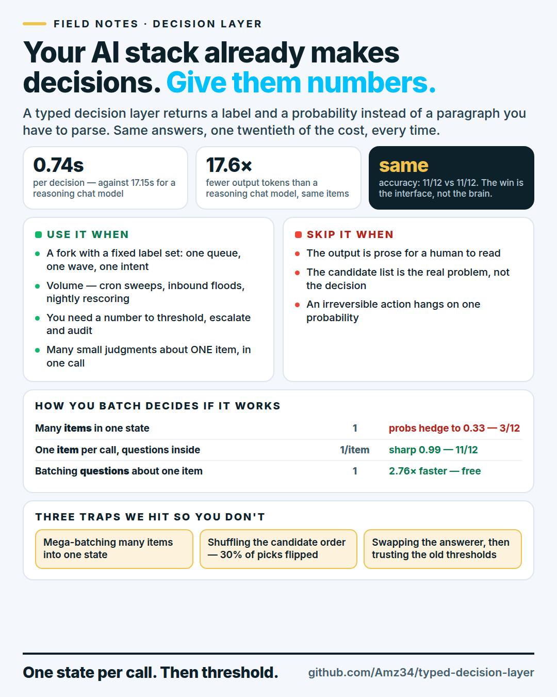

# Typed decision layer

**Put the small decisions in your AI stack on rails: a label and a probability, not a paragraph.**

`github.com/Amz34/typed-decision-layer` — every number below is reproducible offline: `make verify`
(no API key, no network) and `make dry` (prints the real request payload).

Most AI stacks route things — tickets to queues, leads to waves, replies to intents, requests to
tools, documents to owners. Today that is usually one of two things: a vector search that returns
a nearest neighbour, or a chat model you ask in prose and then parse.

This repo is the third option, and the field notes from running it in production: a **typed
decision layer**. You ask a *typed* question, you get a probability distribution back. Numbers you
can threshold, escalate on, log, and evaluate — instead of a sentence you hope behaves.

[](CHEATSHEET.md)

---

## The 20-second version

We A/B'd a typed decision lane against chat models on **the same items, the same candidate lists**,
changing only the answerer. What came back:

| | typed decision lane | chat model | ratio |
| --- | --- | --- | --- |
| hit rate (same items) | 26.7% | 28.3% | **a wash** |
| hit rate, 6-use-case production lane | 8/8 on the case with gold labels | 8/8 | **a wash** |
| mean latency / decision | 0.74 s | 17.15 s | **~23× faster** |
| output tokens | 14.7 k total | 258.3 k total | **17.6× fewer** |
| valid probability distributions | **77/77 clean** | 0/77 (needed the lenient parser) | — |
| hedged answers (top-1 < 0.50) | 0 / 12 | 12 / 12 | — |

So the honest headline is not "it is smarter". It is **"it is the same answers at a twentieth of
the cost, and every answer arrives as a number you can act on automatically."** If your stack is
full of little forks, that is the difference between a gate you can trust and a prompt you babysit.

Want the reverse of a sales pitch? [Where this does **not** help](docs/measurements.md#where-it-does-not-help) —
it is the section we would read first.

---

## What a typed decision is

Three primitives, nothing more:

| primitive | question shape | you get back |
| --- | --- | --- |
| **Choice** | "which one of these N labels?" (with a description per label) | a probability per label |
| **Score** | "put a number on this" | a number |
| **Noul** | "yes or no?" | a probability |

```python
from decision_client import ask, pick, scalar

answers, usage, latency, _ = ask(
    "Ticket: An ex-employee still has access to our workspace and is still getting the digest.",
    {
        "route": {
            "type": "choice",
            "instructions": "Which single queue should own this ticket?",
            "criteria": {
                "billing": "Money: invoices, charges, refunds",
                "technical": "The product is broken, slow, or losing data",
                "account": "People, access, seats, login, settings",
                "security": "Fraud, impersonation, credentials, abuse",
            },
        },
        "needs_human": {
            "type": "noul",
            "instructions": "Does this need a human to reply personally, not a self-serve answer?",
        },
    },
)

route, prob = pick(answers["route"])          # -> ("security", 1.00)
human       = scalar(answers["needs_human"])  # -> 0.87
action      = "escalate" if human >= 0.70 else "auto"
print(route, prob, human, action, f"{latency:.2f}s")
```

One request, two typed judgments, one thresholded action. No JSON repair, no "as an AI language
model", no regex over prose.

---

## Quickstart

```bash
cd harness
python3 decision_client.py --selftest     # offline: parsing + batching, no key, no network
python3 demo_triage.py --dry-run          # see the exact request that would be sent
export TYPESAFE_API_KEY=...               # any typed-decision endpoint
python3 demo_triage.py --per-item --workers 8
python3 bench.py --lane decision           # this lane
python3 bench.py --lane chat               # same items, your chat model
```

Stdlib only. No dependencies, no framework, no vendored SDK. `DECISION_API_URL` /
`DECISION_MODEL` / `DECISION_API_KEY_ENV` point it at whatever endpoint you use.

---

## The three shapes (measured, reproducible in this repo)

Same 12 tickets, same 6 queues, same model. The only variable is *how you batch*:

| shape | requests | wall | input / output tokens | route hit | mean top-1 prob |
| --- | --- | --- | --- | --- | --- |
| `--per-item --workers 8` | 12 | **1.53 s** | 6,029 / 949 | **11/12** | **0.99** |
| `--one-at-a-time` | 12 | 9.15 s | 6,029 / 949 | 11/12 | 0.99 |
| `--mega-batch` | **1** | 0.98 s | 3,224 / 1,012 | **3/12** | 0.33 |

That last row is the trap, and it cost us a real afternoon:

> **Batching many *questions about one item* is free. Batching many *items* into one state is a
> trap.** The mega-batch is one round trip and looks efficient — and the distributions collapse to
> a uniform hedge across a page of unrelated tickets, so the answers become worthless. One state
> per call, fan the calls out concurrently: 12 round trips, 1.5 s wall, sharp distributions.

---

## Rules we would not skip

1. **Score the interface, not the vibe.** Run the same items through both answerers and print hit
   rate *and* mean top-1 probability. A lane that is right 11/12 with p=0.99 is a lane you can
   automate; right 11/12 at p=0.33 is a coin flip wearing a confident label.
2. **Check the ceiling before you blame the model.** If the gold label is not in the candidate list,
   no answerer can be right. In our routing eval the gold was in the shortlist only **46.7%** of the
   time — the retriever, not the decision layer, was the bottleneck. Report the ceiling next to the
   hit rate, always.
3. **One state per call.** See the table above. Do not put a page of items in one prompt and index
   the questions by ID.
4. **Batch the questions, not the work.** 13 typed questions about one state = one request:
   8.96 s vs 24.69 s for 13 sequential calls (2.76× faster, 13:1 fewer round trips). That claim does
   survive — as long as rule 3 holds.
5. **Threshold on the number, and log it.** The gate (`escalate` / `review` / `auto`) is where the
   value is. Store the probability with the decision so you can audit it later.
6. **Re-check candidate order.** Shuffling the option order flipped **30%** of picks (7/10 identical).
   Pin the order, or verify it does not matter for your labels.
7. **Re-calibrate when you swap the answerer.** Thresholds fitted to one model's probability
   distribution silently change the action mix when you change models — same code, same policy,
   0 → 7 items moved from `review` to `act` in our lane. Recalibrate on labels, not on vibes.
8. **Keep a fast chat model in the loop where judgment matters.** A decision layer wins on narrow
   forks with a fixed label set. On an ambiguous case it still picks *something*. Route the
   low-confidence tail to a human or a reasoning model instead of pretending p=0.34 is a decision.

---

## Self-QA (the questions we got on the post)

**"Isn't this just prompt engineering with JSON?"** Partly — and that is the useful part. A chat
model asked for JSON *can* answer this; in our lane it needed the lenient parser on **77 of 77**
calls, while the typed endpoint returned validator-clean full distributions on 77/77. The contract
is the product.

**"So it is more accurate?"** No. Same accuracy on our data, within noise. If your only problem is
accuracy, this is not the fix — see rule 2.

**"Cheaper tokens?"** Against a *reasoning* model: 18× fewer output tokens. Against a terse chat
model that answers with one label, output tokens are a wash (it prints `{"route":"billing"}` = 6
tokens; we print a 6-way distribution). You are buying determinism, latency and thresholdability,
not tokens. We would rather say that out loud than sell you a number.

**"What breaks it?"** Bad candidate lists (rule 2), mega-batches (rule 3), swapped models without
recalibration (rule 7), and irreversible actions taken on a single un-thresholded probability.

**"Is it worth a dependency?"** Run `bench.py` on 20 of your own items. It takes ten minutes and
costs less than a cup of coffee, and you will know for your stack instead of for mine.

---

## Layout

```
harness/decision_client.py   one function: typed request in, probabilities out (stdlib only)
harness/demo_triage.py       the 3 batching shapes, side by side, on 12 tickets
harness/bench.py             same items, two answerers, hit rate + ceiling + hedging
harness/data/tickets.jsonl   12 support tickets with gold queues (demo data)
docs/measurements.md         method, tables, caveats, what we could not reproduce
CHEATSHEET.md                the one-pager (and the image above)
```

## License

MIT — see [LICENSE](LICENSE). The demo tickets, code and numbers are ours; reproduce, correct or
contradict them with `bench.py`.
